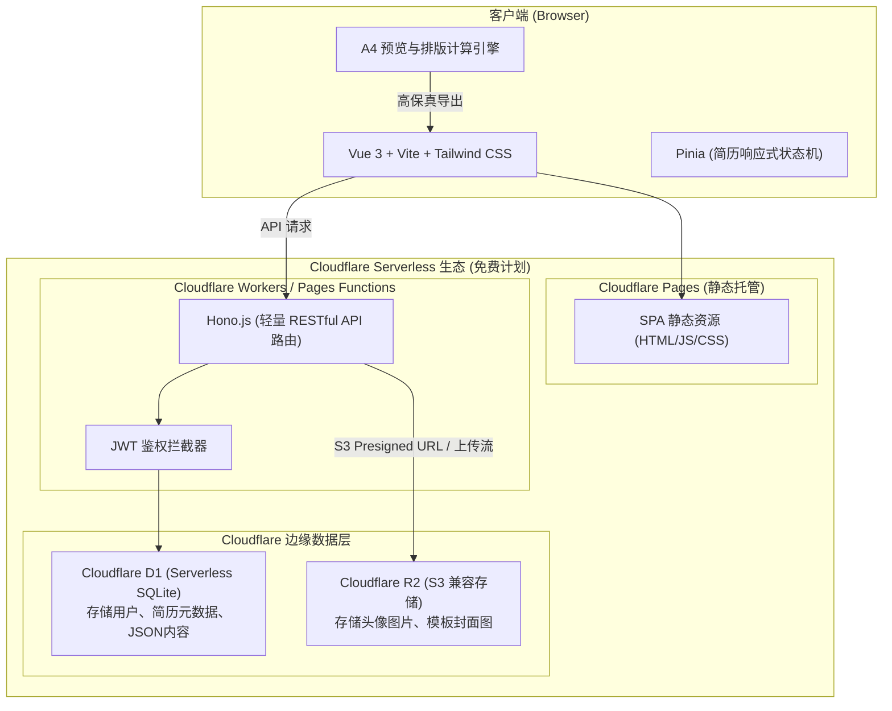
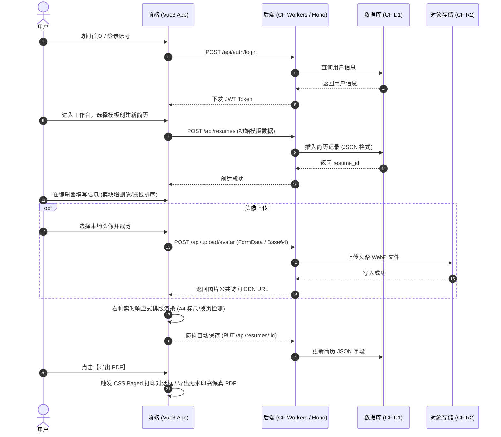
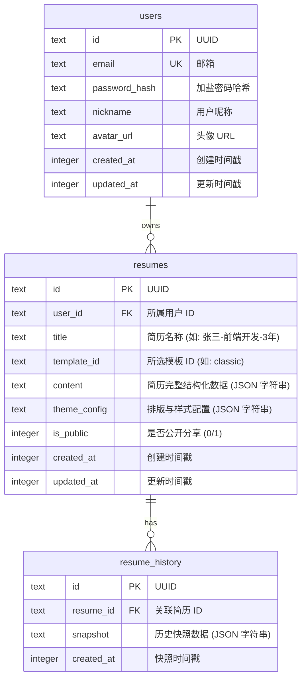

# 极简智能简历平台 (OpenResume) 产品需求文档 (PRD)

| 文档版本 | 状态 | 编写日期 | 适用范围 |
| :--- | :--- | :--- | :--- |
| v1.0.0 | 初稿 (MVP 规划) | 2026-09-27 | Web 前后端、Cloudflare Serverless 架构 |

---

## 1. 项目背景与产品定位

### 1.1 项目背景
求职过程中，一份排版专业、信息清晰的简历是求职者的敲门砖。当前国内主流简历制作平台（如超级简历 WonderCV、知页简历、木及简历等）大多体验良好，但普遍存在强制付费导出、高额会员订阅、导出格式错乱、数据隐私受限等痛点。

本项目旨在打造一款开源/轻量级、体验接近国内一线水准的现代化简历制作 Web 应用，**前后端完全基于 Cloudflare 免费生态部署**，以零服务器运维成本、全球边缘加速为特色，提供“开箱即用、所见即所得、自由导出”的纯粹制作体验。

### 1.2 产品定位
- **定位**：轻量级、高颜值、所见即所得的极简简历制作工具。
- **目标用户**：应届毕业生、互联网/泛技术从业者、白领求职者。
- **核心卖点**：
  - **国内主流交互体验**：左侧模块化内容表单 + 右侧实时 A4 纸张排版渲染（自适应缩放与分页标线）。
  - **零成本云原生架构**：全面拥抱 Cloudflare Pages + Workers + D1 + R2 免费套餐。
  - **模板内容解耦**：换模板不丢失/不破坏内容数据，支持个性化主题色与排版微调。
  - **高质量 PDF 导出**：无水印、高保真矢量打印/渲染导出。

---

## 2. 竞品参考与核心差异化

| 维度 | 超级简历 / 知页简历 | 本项目 (MVP) |
| :--- | :--- | :--- |
| **交互模式** | 左侧结构化录入，右侧 A4 真实比例预览 | 采用相同的“左右双栏 / 单栏切换”交互，保证最佳编辑习惯 |
| **排版引擎** | 严谨的单页/多页自适应，自动优化间距 | 基于 CSS Paged Media + 虚拟 A4 高度检测，支持一键页面对齐 |
| **模板与收费**| 少数基础模板免费，精美模板/导出限制收费 | 内置 3 套高质量通用模板，完全免费无水印 |
| **部署与成本**| 传统云主机 + 集中式数据库，成本高 | Cloudflare Workers + D1 + R2，永久免费计划覆盖个人与中小流量 |

---

## 3. 技术架构与选型



### 3.1 技术栈清单
- **前端技术栈**：
  - 核心框架：Vue 3 (Composition API, `<script setup>`)
  - 构建工具：Vite
  - UI 与样式：Tailwind CSS + Lucide Vue Next (图标库)
  - 状态管理：Pinia
  - 路由管理：Vue Router 4
  - 拖拽排序：`vuedraggable` (基于 Sortable.js)
  - PDF 导出方案：
    - 方案 A（首选/最高清）：基于浏览器原生打印引擎 `@media print` 调起无损矢量打印为 PDF。
    - 方案 B（辅助降级）：客户端 `html2pdf.js` / `jspdf` + `html2canvas` 导出。
- **后端技术栈**：
  - 运行环境：Cloudflare Workers / Pages Functions (Edge Runtime)
  - 服务端框架：[Hono](https://hono.dev/) (专为边缘计算优化的 Web 框架，轻量高性能，仅几 KB)
  - 接口规范：RESTful API，JSON 交互
  - 认证方案：轻量 JWT (HMAC-SHA256) + Web Crypto API
- **存储方案**：
  - 结构化数据：**Cloudflare D1** (Serverless SQLite)，用于存储用户账号信息、简历 JSON 树、模板配置。
  - 二进制与对象存储：**Cloudflare R2**，用于用户头像图片上传与裁剪存储（免费额度 10GB，免出口流量费）。

### 3.2 Cloudflare 免费配额适配评估
- **D1 免费额度**：每天 500 万行读取、10 万行写入，总容量 5GB。
  - *应对方案*：简历编辑过程采用**前端防抖 3 秒 + 手动保存**结合，大幅降低写频次。
- **R2 免费额度**：10GB 存储，每月 100 万次写（Class A）、1000 万次读（Class B），出口流量完全免费。
  - *应对方案*：前端对头像在 Canvas 中进行预缩放和 WebP 压缩（限定不超过 200KB），直接节省空间。
- **Workers 免费额度**：每天 10 万次请求，10ms CPU 时间/请求。
  - *应对方案*：前端静态资源托管在 Cloudflare Pages（无限流量），仅业务 API 走 Workers，轻量 Hono 处理纯 JSON 耗时 < 3ms。

---

## 4. 用户角色与业务主流程

### 4.1 用户角色
- **访客**：未登录用户，可进入首页体验模板预览、试用在线编辑器（本地 LocalStorage 存储），导出前引导注册/登录或直接临时导出。
- **注册求职者**：拥有个人账号，简历数据实时云端持久化，支持多份简历管理、头像云存储。

### 4.2 核心业务流程图



---

## 5. 功能需求规格说明 (MVP 核心范围)

### 5.1 模块结构与划分

```
极简简历平台 (MVP)
├── 1. 用户与认证系统
│   ├── 邮箱/密码注册与登录
│   └── 退出登录与登录态维持 (JWT)
├── 2. 简历管理看板 (Dashboard)
│   ├── 我的简历列表 (新建、重命名、复制、删除)
│   └── 模板库中心 (缩略图展示、一键应用)
├── 3. 核心简历编辑器 (Core Editor)
│   ├── 3.1 左侧结构化编辑面板 (表单输入 + 模块控制)
│   ├── 3.2 右侧实时 A4 预览画布 (所见即所得 + 缩放自适应)
│   ├── 3.3 顶部控制工具栏 (模板切换、样式设置、状态提示、操作区)
│   └── 3.4 模块拖拽排序与显隐开关
├── 4. 存储与多媒体服务
│   ├── 头像本地裁剪与压缩
│   └── Cloudflare R2 头像存储与访问
└── 5. 导出与排版工具
    ├── 浏览器原生矢量打印导出 (A4 标准无缝分页)
    └── 页面高度警告与自动一页纸排版辅助
```

---

### 5.2 核心功能详细说明

#### 模块一：用户与认证模块
- **注册/登录**：
  - 邮箱 + 密码注册，密码经客户端或边缘端 SHA-256 加盐哈希存入 D1。
  - JWT Token 机制：有效期 7 天，保存在前端 `localStorage`，请求通过 `Authorization: Bearer <token>` 传递。
  - *MVP 范围*：暂不接入繁琐的第三方微信扫描/短信验证码，使用简单可靠的邮箱+密码体系。

#### 模块二：简历管理看板 (Dashboard)
- **简历列表卡片**：
  - 展示简历名称、最后更新时间、所用模板标识、缩略封面或预览徽标。
  - 操作支持：【继续编辑】、【复制一份】、【重命名】、【删除】。
  - 新建简历：从模板库选择初始化，或从预置示例数据直接新建。

#### 模块三：核心简历编辑器 (最核心)
参考超级简历的交互布局，采用经典 **左右分栏布局**：

##### 1. 左侧结构化编辑抽屉/面板
支持标准模块录入，每个模块可增删条目、拖拽排序、开启/隐藏：
- **基本信息 (Basic Info)**：
  - 姓名、求职意向/职位名称、手机号码、电子邮箱、所在城市、工作年限、期望薪资（可选）。
  - 头像支持：点击上传、圆形/方形切换、隐藏头像开关。
  - 社交链接/个人主页（GitHub、技术博客、作品集）。
- **教育经历 (Education)**：
  - 学校名称、专业、学历（大专/本科/硕士/博士等）、起止时间、主修课程/成绩排名。
- **工作/实习经历 (Work Experience)**：
  - 公司名称、职位、部门、起止时间、工作内容与产出（支持 STAR 法则分点描述，具备加粗/斜体/无序列表等微型富文本能力）。
- **项目经历 (Projects)**：
  - 项目名称、担任角色、起止时间、项目链接、项目描述、核心贡献。
- **专业技能 (Skills)**：
  - 标签化或纯文本分段录入（如前端技能、后端技能、英语水平等）。
- **自定义模块 (Custom Sections)**：
  - 允许用户添加 1~2 个自定义模块（如“荣誉奖项”、“自我评价”、“个人证书”）。
- **模块管理面板**：
  - 支持上下拖拽改变模块在简历上的先后排版顺序（例如：刚毕业学生可将教育经历排在工作之前；资深人士可将工作经验排在第一位）。

##### 2. 右侧实时 A4 预览画布 (Preview Canvas)
- **真实比例画布**：
  - 标准国际 A4 纸张比例（宽 210mm × 高 297mm，按当前屏幕 DPI 缩放渲染）。
  - 页面底部提供画布缩放控件：`50% ~ 150%` 或“自适应屏幕宽度”。
- **分页指示线 (Page Breaks Detector)**：
  - 当内容超出 1 页（297mm）高度时，画布呈现动态红色/虚线【第 1 页截断线】，并提示用户调整内容或进入多页模式。
- **即时响应**：
  - 左侧表单任何按键输入，右侧无延迟更新（Pinia 状态驱动）。

##### 3. 顶部全局控制工具栏 (Editor Toolbar)
- **模板切换**：抽屉式切换内置 3 套模板。
- **排版微调器 (Theme & Layout Settings)**：
  - **主题色**：预置 8 种高雅商务色系（商务蓝、远峰蓝、雅致黑、橄榄绿、酒红等），支持自定义 Hex 色值。
  - **字号阶梯**：紧凑 (12px) / 标准 (14px) / 宽松 (15px)。
  - **段落与行间距**：`1.2` / `1.4` / `1.6`。
  - **模块垂直间距**：支持滑块微调，方便用户“一键填满一页纸”或“紧缩防超页”。
  - **页边距控制**：紧凑 (15mm) / 适中 (20mm) / 宽松 (25mm)。
- **状态提示**：
  - 自动显示“已保存到云端”或“草稿保存中...”。
- **动作按钮**：
  - 【预览】、【清空示例】、【导出 PDF】。

#### 模块四：内置模板体系 (MVP 阶段提供 3 套)
1. **经典通用型 (Classic)**：黑白灰 + 商务强调色，顶部个人信息居中，横线分割各模块，适合绝大部分行业。
2. **极简极客型 (Geek / Minimal)**：左对齐，弱化边框线，强化技能标签与代码风格链接，极度适合程序员/技术岗位。
3. **现代侧栏型 (Modern Sidebar)**：左侧 1/3 深色/浅灰底色展示个人信息、技能、语言；右侧 2/3 展示经历与项目，视觉层次分明。

#### 模块五：PDF 高保真导出方案
- **首选方案（原生打印媒介）**：
  - 利用 `@media print` 样式，隐藏非打印区域（导航栏、侧边栏、按钮等）。
  - 配置标准 `@page { size: A4 portrait; margin: 0; }`。
  - 调起 `window.print()`，用户直接另存为 PDF，文字为矢量原生字符，支持超链接点击、文字复制、文件体积极小（几百 KB）。
- **降级/一键下载方案**：
  - 集成 `html2canvas` + `jspdf`，在不支持直接打印的移动端或特殊环境下提供直接下载 `.pdf`。

---

## 6. 数据结构与数据库设计 (Cloudflare D1)

系统使用 Cloudflare D1 (SQLite) 存储核心数据。

### 6.1 ER 图与表关系



### 6.2 DDL 建表 SQL 语句 (`schema.sql`)

```sql
-- 1. 用户表
CREATE TABLE IF NOT EXISTS users (
    id TEXT PRIMARY KEY,
    email TEXT UNIQUE NOT NULL,
    password_hash TEXT NOT NULL,
    nickname TEXT,
    avatar_url TEXT,
    created_at INTEGER NOT NULL DEFAULT (unixepoch()),
    updated_at INTEGER NOT NULL DEFAULT (unixepoch())
);
CREATE INDEX IF NOT EXISTS idx_users_email ON users(email);

-- 2. 简历主表
CREATE TABLE IF NOT EXISTS resumes (
    id TEXT PRIMARY KEY,
    user_id TEXT NOT NULL,
    title TEXT NOT NULL DEFAULT '未命名简历',
    template_id TEXT NOT NULL DEFAULT 'classic',
    content TEXT NOT NULL,          -- 核心简历 JSON
    theme_config TEXT NOT NULL,     -- 样式排版 JSON (字体/颜色/间距)
    is_public INTEGER NOT NULL DEFAULT 0,
    created_at INTEGER NOT NULL DEFAULT (unixepoch()),
    updated_at INTEGER NOT NULL DEFAULT (unixepoch()),
    FOREIGN KEY (user_id) REFERENCES users(id) ON DELETE CASCADE
);
CREATE INDEX IF NOT EXISTS idx_resumes_user ON resumes(user_id);

-- 3. 简历历史版本表 (为后续版本撤销/回滚预留)
CREATE TABLE IF NOT EXISTS resume_history (
    id TEXT PRIMARY KEY,
    resume_id TEXT NOT NULL,
    snapshot TEXT NOT NULL,
    created_at INTEGER NOT NULL DEFAULT (unixepoch()),
    FOREIGN KEY (resume_id) REFERENCES resumes(id) ON DELETE CASCADE
);
CREATE INDEX IF NOT EXISTS idx_history_resume ON resume_history(resume_id);
```

### 6.3 简历数据核心 JSON Schema (`content` 字段结构定义)

```json
{
  "profile": {
    "name": "张小凡",
    "title": "资深前端工程师",
    "email": "xiaofan@example.com",
    "phone": "13800138000",
    "location": "北京·海淀",
    "avatar": "https://r2.yourdomain.com/avatars/xxxx.webp",
    "showAvatar": true,
    "github": "https://github.com/example",
    "website": "https://blog.example.com",
    "summary": "5年前端开发经验，精通Vue3与微前端架构..."
  },
  "modulesOrder": ["education", "work", "projects", "skills", "custom"],
  "modules": {
    "education": {
      "visible": true,
      "title": "教育背景",
      "items": [
        {
          "id": "edu-1",
          "school": "北京航空航天大学",
          "major": "计算机科学与技术",
          "degree": "硕士",
          "startDate": "2019-09",
          "endDate": "2022-06",
          "description": "GPA: 3.8/4.0，获得国家奖学金"
        }
      ]
    },
    "work": {
      "visible": true,
      "title": "工作经历",
      "items": [
        {
          "id": "work-1",
          "company": "某知名互联网大厂",
          "department": "核心研发部",
          "position": "前端技术专家",
          "startDate": "2022-07",
          "endDate": "至今",
          "description": "• 负责低代码平台核心渲染引擎设计与研发；\n• 页面加载性能提升 40%，首屏耗时降至 800ms。"
        }
      ]
    },
    "projects": {
      "visible": true,
      "title": "项目经验",
      "items": [
        {
          "id": "proj-1",
          "name": "企业级协同设计系统",
          "role": "核心架构师",
          "startDate": "2023-01",
          "endDate": "2023-10",
          "link": "https://project.example.com",
          "description": "基于 Canvas 与 WebAssembly 实现的高性能在线制图引擎。"
        }
      ]
    },
    "skills": {
      "visible": true,
      "title": "专业技能",
      "items": [
        "熟练掌握 Vue3 / TypeScript / Vite 现代前端工程化生态体系",
        "深入理解浏览器渲染机制与前端前沿性能调优方案",
        "具备全栈开发视野，熟悉 Node.js / Hono 及 Serverless 边缘计算架构"
      ]
    },
    "custom": {
      "visible": false,
      "title": "荣誉奖项",
      "items": [
        "2023 年度优秀员工",
        "全国大学生程序设计竞赛 (ACM-ICPC) 铜牌"
      ]
    }
  }
}
```

### 6.4 样式排版 JSON Schema (`theme_config` 字段结构定义)

```json
{
  "themeColor": "#2563EB",
  "fontFamily": "font-sans",
  "fontSize": 14,
  "lineHeight": 1.5,
  "paragraphSpacing": 8,
  "sectionSpacing": 16,
  "pagePadding": 20,
  "showBorder": true
}
```

---

## 7. 后端 API 接口设计 (Hono on Cloudflare Workers)

所有接口统一以 `/api` 为前缀，返回格式统一为：
```json
{
  "code": 0,
  "message": "success",
  "data": {}
}
```

### 7.1 认证模块 (`/api/auth`)
| 方法 | 路径 | 鉴权要求 | 说明 |
| :--- | :--- | :--- | :--- |
| `POST` | `/api/auth/register` | 公开 | 邮箱+密码注册 |
| `POST` | `/api/auth/login` | 公开 | 邮箱+密码登录，返回 JWT Token & 用户信息 |
| `GET` | `/api/auth/me` | Bearer Token | 获取当前登录用户的基本信息 |

### 7.2 简历管理与数据持久化 (`/api/resumes`)
| 方法 | 路径 | 鉴权要求 | 说明 |
| :--- | :--- | :--- | :--- |
| `GET` | `/api/resumes` | Bearer Token | 获取当前用户的所有简历列表（不含大文本 content） |
| `POST` | `/api/resumes` | Bearer Token | 创建一份新简历（可指定初始化模板及示例数据） |
| `GET` | `/api/resumes/:id` | Bearer Token | 获取单份简历的完整配置与内容数据 |
| `PUT` | `/api/resumes/:id` | Bearer Token | 保存更新简历（全量/增量保存 content 和 theme_config） |
| `DELETE` | `/api/resumes/:id` | Bearer Token | 删除指定简历 |
| `POST` | `/api/resumes/:id/duplicate`| Bearer Token | 复制当前简历为新的一份副本 |

### 7.3 文件上传 (`/api/upload`) - Cloudflare R2
| 方法 | 路径 | 鉴权要求 | 说明 |
| :--- | :--- | :--- | :--- |
| `POST` | `/api/upload/avatar` | Bearer Token | 上传头像文件，存储至 R2，返回公开 CDN 访问链接 |

---

## 8. 页面原型与交互视觉设计规范

### 8.1 页面清单与路由映射
| 页面名称 | 路由路径 | 核心组件/功能 |
| :--- | :--- | :--- |
| **首页 (Landing Page)** | `/` | 平台介绍、特色特性、模板展示轮播、CTA“免费制作简历”入口 |
| **工作台 (Dashboard)** | `/dashboard` | 我的简历列表、新建简历弹窗、模板选择卡片、个人设置 |
| **编辑器页 (Editor)** | `/editor/:id` | 左侧多模块编辑面板、右侧实时 A4 纸张、顶部功能栏（核心页面） |
| **只读分享页 (Share)** | `/share/:id` | 独立纯净的简历只读预览页，支持直接在线打印/下载 |

### 8.2 核心编辑器页面布局设计 (Wireframe)

```
+-------------------------------------------------------------------------------------------------------+
|  [Logo] OpenResume | 简历: [张三-前端研发工程师 ✏️]   [云端已保存 11:42]  |  [模板切换] [排版设置] [导出 PDF]  |
+---------------------------------------------------+---------------------------------------------------+
|  <<< 左侧表单编辑区 (可滚动, 宽度 45%)             |  >>> 右侧实时 A4 预览画布 (居中, 宽度 55%)           |
+---------------------------------------------------+---------------------------------------------------+
|  [模块导航: 个人信息 | 教育 | 工作 | 项目 | 技能]  |      缩放控制: [ - ]  100%  [ + ]  [适应宽度]          |
|                                                   |                                                   |
|  ▼ 个人信息                                       |  +---------------------------------------------+  |
|  [上传头像] 姓名: [张小凡]  意向: [前端开发]        |  | 姓名: 张小凡              求职意向: 前端开发   |  |
|  电话: [138xxxx] 邮箱: [test@163.com]             |  | 电话: 13800000000        邮箱: test@163.com   |  |
|  GitHub: [https://...]                            |  |---------------------------------------------|  |
|                                                   |  | ■ 教育背景                                  |  |
|  ▼ 工作经历 [ + 添加一段 ]                        |  | 2019-2022  北京航空航天大学 · 计算机 (硕士)    |  |
|  -----------------------------------------------  |  |---------------------------------------------|  |
|  :: [某知名大厂]  职位: [前端开发] [2022 - 至今]   |  | ■ 工作经历                                  |  |
|     工作描述: [富文本/Markdown 分点支持...]       |  | 某知名大厂 · 前端开发 (2022-至今)            |  |
|  :: [某初创科技]  职位: [实习生]   [2021 - 2022]   |  | • 负责核心渲染引擎设计与研发...               |  |
|                                                   |  | • 优化首屏加载性能提升 40%...                 |  |
|  ▼ 项目经验 [ + 添加一段 ]                        |  |---------------------------------------------|  |
|  ...                                              |  | - - - - - - - - - A4 第 1 页截断线 - - - - -|  |
|                                                   |  | (若内容超出会在此清晰标注跨页位置)            |  |
|  [拖拽调整模块上下顺序 ↕]                         |  +---------------------------------------------+  |
+---------------------------------------------------+---------------------------------------------------+
```

---

## 9. 部署与实施方案 (全流程 Cloudflare 免费套件)

### 9.1 架构部署步骤
1. **Cloudflare D1 初始化**：
   - 使用 Wrangler CLI 创建 D1 数据库：`npx wrangler d1 create open-resume-db`
   - 执行 SQL 初始化：`npx wrangler d1 execute open-resume-db --file=./schema.sql`
2. **Cloudflare R2 存储桶初始化**：
   - 创建公开/绑权 Bucket：`npx wrangler r2 bucket create open-resume-assets`
   - 绑定自定义域名或启用 r2.dev 公开读取访问，配置 CORS 允许前端跨域加载图片。
3. **前端 (Cloudflare Pages)**：
   - 关联 GitHub 仓库，配置构建命令 `pnpm build`，输出目录 `dist`。
   - 享受全球边缘 Anycast 毫秒级 CDN 分发。
4. **后端 (Cloudflare Workers / Pages Functions)**：
   - 采用 Hono.js 编写，在 `wrangler.toml` 中绑定 D1 数据库实例及 R2 Bucket：
     ```toml
     [[d1_databases]]
     binding = "DB"
     database_name = "open-resume-db"
     database_id = "<your-d1-id>"

     [[r2_buckets]]
     binding = "BUCKET"
     bucket_name = "open-resume-assets"
     ```

---

## 10. 迭代规划与路线图 (Roadmap)

### Phase 1：MVP 核心版本 (当前阶段)
- [ ] 初始化项目骨架：Vue 3 前端 + Hono 后端 Workers 配置
- [ ] D1 数据库设计与建表，用户简易认证体系
- [ ] 核心简历状态机（Pinia）设计，支持结构化模块录入
- [ ] 左右分栏核心编辑器，实现第 1 套经典通用模板 (Classic)
- [ ] 实时 A4 渲染比例引擎与分页指示线计算
- [ ] 原生高保真无损 PDF 打印/导出适配
- [ ] 头像裁剪与 Cloudflare R2 边缘存储上传
- [ ] 自动化防抖保存与 D1 持久化

### Phase 2：体验进阶与多样性 (后续规划)
- [ ] 增加第 2、3 套模板（极简程序员风、双栏现代商务风）
- [ ] 模块拖拽排序 (`vuedraggable`) 体验调优
- [ ] 提供国内求职示例模版库（前端开发、产品经理、运营、应届生各一套标准范文）
- [ ] 支持在线一键生成公开只读分享链接 (`/share/:id`)

### Phase 3：智能化与生态扩展 (未来展望)
- [ ] 集成 Cloudflare Workers AI 或大模型 API，提供简历润色、STAR 格式重写、语法检查
- [ ] 多语言支持（中文/英文一键切换）
- [ ] 导入已有 JSON / Markdown 简历一键转换
