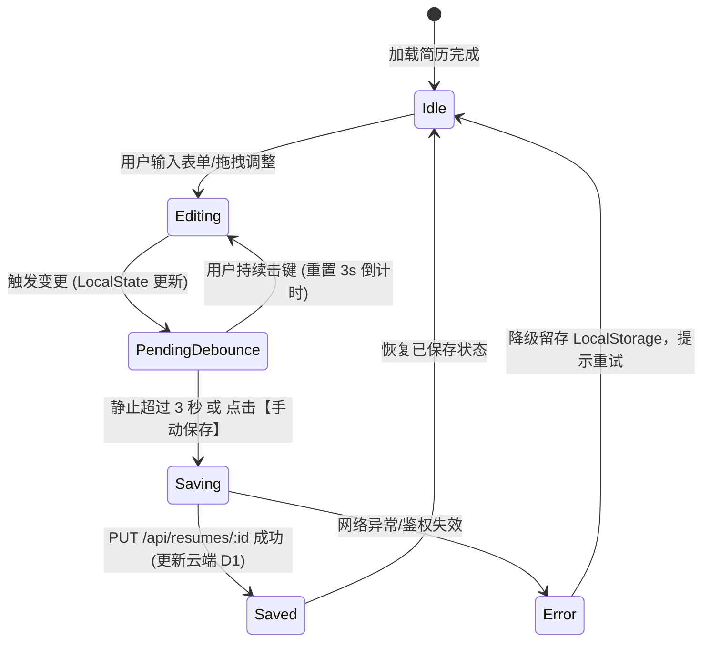

# 极简简历平台 (OpenResume) 详细需求规格说明书 (SRS)

| 规范文档编号 | 版本 | 编写日期 | 关联 PRD | 适用阶段 |
| :--- | :--- | :--- | :--- | :--- |
| SRS-2026-RESUME-001 | v1.0.0 | 2026-09-27 | [docs/PRD.md](file:///d:/Dev/open-resume/docs/PRD.md) | MVP 详细设计、研发实现与测试验收 |

---

## 1. 概述与目标

### 1.1 文档定位
本文档作为 [docs/PRD.md](file:///d:/Dev/open-resume/docs/PRD.md) 的落地执行细化版本，深度参考国内热门简历平台（**超级简历 WonderCV、知页简历、木及简历、牛客简历**）的成熟交互与排版机制，制定出涵盖**业务用例、字段规格、交互细节、异常处理、排版避让算法及验收指标**的高颗粒度需求规格，为前端 Vue 3、后端 Cloudflare Workers/D1/R2 的研发和 QA 测试提供直接依据。

### 1.2 核心术语与定义表
| 术语 / 标识 | 英文全称 / 代码符号 | 解释说明 |
| :--- | :--- | :--- |
| **A4 物理画布** | A4 Physical Canvas | 标准国际纸张尺寸（210mm × 297mm），在 96 DPI 下基准像素为 794px × 1123px。 |
| **分页截断线** | Page Break Indicator | 在预览画布中标识物理页面分割位置的动态辅助虚线，辅助排版。 |
| **防抖自动保存** | Debounced Auto-Save | 用户的击键操作在停止输入 3 秒后触发云端 D1 持久化，避免高频写入消耗免费配额。 |
| **STAR 原则** | Situation, Task, Action, Result | 国内求职简历经历描述的黄金法则，编辑器需提供对应辅助输入结构。 |
| **断页避让** | Break-Inside Avoidance | CSS 排版规则，防止一个工作经历子条目或标题行刚好被截断在两页的接缝处。 |
| **数据与视图解耦** | Data-View Decoupling | 简历数据采用通用 JSON 存储，切换不同风格模板时内容 100% 完整保留。 |

---

## 2. 用户角色与典型使用场景 (User Scenarios)

### 2.1 用户角色画像
1. **校招学生 / 实习生（小明）**：
   - *特点*：工作经历较少，容易出现“内容太少导致下半页空白”。
   - *核心诉求*：需要教育背景置顶、支持技能和校内活动重点展示，需要“一键适当放大行距/间距以填满一页纸”的能力。
2. **社招中高级工程师 / 泛技术求职者（李华）**：
   - *特点*：项目多、技术栈多、经历丰富，容易“内容刚好超出一页纸（1.1~1.2页）”。
   - *核心诉求*：需要突出技能清单、项目链接、STAR 法则条目，需要“紧凑排版微调”以精准收敛至整 1 页或整 2 页，且要求导出 PDF 必须支持外链点击与文字复制。
3. **免登录快速体验者（访客）**：
   - *特点*：不愿先注册，想直接看到编辑效果与导出质量。
   - *核心诉求*：打开即用，本地保存，满意后再注册同步。

---

## 3. 国内热门竞品核心功能参考与对标

| 竞品功能点 | 超级简历 (WonderCV) | 知页简历 | 本项目 (OpenResume) 落地规范 |
| :--- | :--- | :--- | :--- |
| **布局模式** | 左侧输入 + 右侧 1:1 预览 | 左右分栏 / 双击直接修改 | **左侧结构化表单 + 右侧 1:1 响应式 A4 画布**（输入效率高且稳定） |
| **排版优化** | 自动一页纸间距调节 | 预设间距挡位 | **支持预设挡位（紧凑/标准/宽松）+ 像素级微调滑块** |
| **内容建议** | STAR 提示、动词库 | 引导文案 | **每个经历模块内置 STAR 引导提示与优质范文占位符** |
| **导出控制** | 强制会员付费导出 PDF | 付费解锁水印 | **完全免费、无水印、原生高保真矢量打印/导出** |
| **跨页检测** | 动态标线与超页红线告警 | 简单分页符 | **动态智能换页线 + 元素级断页保护 (`break-inside: avoid`)** |

---

## 4. 详细功能需求规格 (Functional Specifications)

```
OpenResume 需求模块全景
├── F1. 用户账户与会话管理 (Auth & Session)
├── F2. 仪表盘与多简历管理 (Dashboard)
├── F3. 编辑器架构与全局工具栏 (Editor Layout & Toolbar)
├── F4. 简历各模块录入规格 (Resume Form Sections)
├── F5. 实时 A4 排版与预览引擎 (Render Engine)
├── F6. 样式与主题控制系统 (Style & Theme Settings)
├── F7. 模板渲染系统 (Template Engine)
├── F8. 头像与文件存储管理 (Cloudflare R2 Integration)
└── F9. 导出交付与打印规范 (Export & Print System)
```

---

### F1. 用户账户与会话管理 (Auth & Session)

#### F1.1 访客试用模式 (Guest Mode)
- **需求描述**：未登录用户访问系统时，可直接进入编辑器使用预置的“前端研发 / 通用求职示例数据”体验完整编辑功能。
- **存储机制**：未登录状态下，简历数据实时保存在浏览器的 `localStorage:open_resume_draft` 中。
- **转化引导**：
  - 点击“保存到云端”或“创建新简历”时，弹出轻量登录/注册弹窗。
  - 用户登录成功后，系统自动检测本地是否存在访客草稿，若存在则提示：“检测到您之前有编辑中的草稿，是否同步并创建为新简历？”（是/放弃）。

#### F1.2 注册与登录
- **输入项**：
  - 电子邮箱（必填，格式符合 RFC 5322 标准正则，长度 ≤ 64 字符）。
  - 登录密码（必填，6~32 字符，包含字母与数字）。
- **安全与校验**：
  - 密码不可明文传输和存储，后端采用加盐哈希（Web Crypto SHA-256）存储于 Cloudflare D1。
  - 接口限制：单 IP 每分钟登录请求限制 ≤ 10 次，防止撞库暴力破解。
- **会话持久化**：
  - 登录成功返回 JWT Token，前端存储在 `localStorage:open_resume_token`。
  - 请求时通过请求头 `Authorization: Bearer <token>` 发送。
  - Token 有效期为 7 天，到期后若响应 401，前端自动清除状态并重定向至登录态。

---

### F2. 仪表盘与多简历管理 (Dashboard)

#### F2.1 简历管理看板界面
- **页面布局**：顶部导航（Logo、用户名、新建简历按钮、登出），下方为网格卡片流（Grid Layout）。
- **新建简历触发**：
  - 点击【+ 新建简历】，弹出模板与初始化数据选择抽屉：
    - 选项 A：使用精选模版 + 预置完整示例数据（推荐，新手体验好）。
    - 选项 B：使用空白模板（仅包含默认字段骨架）。
- **简历卡片展示项**：
  - 简历缩略预览图或模板示意徽标。
  - 简历标题（支持即时双击重命名，默认格式为：`未命名简历_YYYYMMDD`）。
  - 模板标识、最后更新时间（友好时间格式，如：“10分钟前”、“昨天 18:30”）。
  - 卡片操作菜单（三点更多）：
    - **继续编辑**：点击进入编辑器路由 `/editor/:id`。
    - **复制一份 (Duplicate)**：完整深拷贝当前简历（content 与 theme_config），并生成新副本（标题自动追加“_副本”）。
    - **重命名**：弹出轻量修改输入框。
    - **删除 (Delete)**：弹出危险警告确认对话框：“删除后无法恢复，是否确认删除该简历？”，点击确定后调用后端软删除/物理删除。

---

### F3. 编辑器架构与全局工具栏 (Editor Layout & Toolbar)

#### F3.1 界面三栏架构
- **顶部操作栏 (Header, 占高 56px)**：
  - 左侧：返回看板按钮、简历标题（内联编辑）、保存状态指示灯（🟢已同步 / 🟡保存中 / 🔴未连接）。
  - 中间：页面模式切换（编辑模式 / 纯享预览模式）、缩放控件（`-`、`100%`、`+`、`适应宽度`）。
  - 右侧：【模板选择】、【排版设置】、【示例重置】、【导出 PDF】主按钮。
- **左侧表单编辑区 (Form Panel, 宽度 40% ~ 45%)**：
  - 顶部为吸顶的模块快速锚点导航栏（个人信息、教育、工作、项目、技能等）。
  - 支持模块上下折叠（Accordion）、支持拖拽手柄调整全局模块上下顺序。
- **右侧 A4 真实画布预览区 (Preview Canvas, 宽度 55% ~ 60%)**：
  - 浅灰色居中背景，中间放置真实比例白色 A4 画布。
  - 画布阴影与圆角设计，模拟真实纸张质感。
  - 缩放变换通过 CSS `transform: scale(zoomRatio)` 实现，保证渲染清晰度。

---

### F4. 简历各模块录入规格 (Resume Form Sections)

所有数据结构映射至统一的 JSON 模型中，每个模块独立配置 `visible: boolean` 显隐属性。

#### F4.1 基本信息模块 (Profile Section)
| 字段名称 | 控件类型 | 校验/长度规则 | 占位提示 (Placeholder) | 备注/交互细节 |
| :--- | :--- | :--- | :--- | :--- |
| **姓名** | 单行文本框 | 必填，1~20 字符 | 如：张小凡 | 加粗展示，字号最大 |
| **求职意向** | 单行文本框 | 必填，1~30 字符 | 如：资深前端工程师 / 架构师 | 作为副标题展示 |
| **手机号码** | 电话输入框 | 必填，标准 11 位手机号格式 | 如：138 0013 8000 | 支持格式化空格分隔显示 |
| **电子邮箱** | 邮箱输入框 | 必填，标准邮箱格式 | 如：xiaofan@example.com | 点击可唤起邮件客户端 |
| **所在城市** | 单行文本框 | 选填，1~20 字符 | 如：北京·海淀 | 可支持输入省/市/区 |
| **工作年限** | 单行文本框 | 选填，1~10 字符 | 如：3年经验 / 应届生 | - |
| **期望薪资** | 单行文本框 | 选填，1~15 字符 | 如：20-25K (可选填) | 用户可自由选择填不填 |
| **头像设置** | 图片上传组件 | 格式：JPG/PNG/WebP，大小 ≤ 2MB | - | 支持“圆形”、“方形”与“隐藏头像”开关 |
| **社交/作品链接** | 动态键值对列表 | 链接格式合法性校验 | 如：GitHub、个人技术博客 | 可动态增删多条链接 |
| **个人总结/简介** | 多行文本域 | 选填，≤ 300 字符 | 一句话亮点概括... | 选填，位于个人信息底部 |

#### F4.2 教育背景模块 (Education Section)
- **子条目结构 (Item Array)**：用户可点击【+ 添加教育经历】无限新增（建议 1~3 条），支持单条拖拽排序与删除。
- **单条目字段规格**：
  - **学校名称**：文本框，必填，如“北京航空航天大学”。
  - **主修专业**：文本框，必填，如“计算机科学与技术”。
  - **学历层次**：下拉选择框，选项：中专 / 大专 / 本科 / 硕士 / 博士 / MBA / 其他。
  - **起止时间**：年月区间选择器（如：`2019.09 - 2023.06`，支持勾选“至今”）。
  - **在校表现/主修课程**：多行文本域，支持分点描述（如“主修数据结构、算法设计；GPA 3.8/4.0”）。

#### F4.3 工作/实习经历模块 (Work Experience Section)
- **子条目结构**：点击【+ 添加工作经历】，单条支持折叠收起、拖拽换序。
- **单条目字段规格**：
  - **公司名称**：文本框，必填，如“阿里巴巴 (中国) 网络技术有限公司”。
  - **职位/角色**：文本框，必填，如“高级前端开发工程师”。
  - **所属部门**：文本框，选填，如“阿里云智能事业群 - 基础架构部”。
  - **起止时间**：年月区间选择器（如：`2022.07 - 至今`）。
  - **工作内容与业绩产出**：
    - **编辑器要求**：支持轻量级富文本/Markdown 快捷键（`Ctrl+B` 加粗关键数据，无序列表分点）。
    - **STAR 引导提示浮层**：在输入框右侧或底部提示：“推荐结构：【背景/任务】+【采取行动 (使用了什么技术)】+【量化结果 (性能提升xx%、业务增长xx%)]”。

#### F4.4 项目经验模块 (Projects Section)
- **子条目结构**：点击【+ 添加项目经历】，条目支持自由增删。
- **单条目字段规格**：
  - **项目名称**：文本框，必填，如“分布式前端监控与埋点告警平台”。
  - **担任角色**：文本框，如“项目核心负责人 / 前端架构”。
  - **起止时间**：年月区间，如：`2023.03 - 2023.11`。
  - **项目链接**：URL 格式（选填），如“https://demo.example.com”，导出 PDF 时保留可点击外链。
  - **项目描述**：项目背景与解决的痛点。
  - **核心职责与成就**：分点 STAR 描述（强调量化数据）。

#### F4.5 专业技能模块 (Skills Section)
- **录入形式双模式支持**：
  - **模式 A（分点陈述模式，推荐）**：多行列表，支持用户逐条录入掌握的技术（例如：“熟练掌握 Vue3 全家桶、TypeScript、Pinia 原理与源码架构”）。
  - **模式 B（分类标签模式）**：分类别录入（如 `前端技能`、`服务端`、`工具链`、`语言证书`），以胶囊标签样式紧凑排版。

#### F4.6 自定义模块 (Custom Section)
- **需求描述**：允许用户自定义添加 1~3 个模块，模块标题完全由用户自由命名（如“荣誉奖项”、“开源贡献”、“专业证书”、“自我评价”）。
- **条目类型**：支持纯列表文本或带起止时间的复合列表。

#### F4.7 全局模块排序与显隐管理
- 在左侧编辑面板顶部或独立设置抽屉中提供【模块管理】：
  - 罗列当前简历的所有模块：基本信息（固定置顶）、教育经历、工作经历、项目经验、专业技能、自定义模块。
  - 右侧提供“眼睛图标”（切换显隐状态），左侧提供拖拽手柄（`drag-handle`），可直接拖动改变其在简历 A4 画布上的自上而下展示顺序。

---

### F5. 实时 A4 排版与预览引擎 (Render Engine)

这是决定产品体验的核心引擎，也是对标超级简历最关键的模块。

#### F5.1 A4 纸张尺寸基准与自适应
- **基准尺寸定义**：
  ```css
  /* 标准 A4 纵向物理比例 */
  .a4-page {
    width: 210mm;
    min-height: 297mm;
    box-sizing: border-box;
    background: #ffffff;
    position: relative;
  }
  ```
- **视图缩放 (Zoom)**：
  - 支持 `50%`、`75%`、`100%`、`125%`、`150%` 与“适应窗口宽度 (Fit-Width)”。
  - 画布容器居中，外层容器计算 `transform: scale(ratio)` 与 `transform-origin: top center`，滚动条原生平滑。

#### F5.2 动态高度计算与换页指示线 (Page Breaks Detector)
- **分页指示线算法**：
  1. 系统在预览容器中注入“虚拟分页检测标线”。
  2. 每一物理页的标准渲染高度为 $H_{page} = 297\text{mm} \approx 1123\text{px}$（在标准 96 DPI 下）。
  3. 当简历渲染内容总高度 $H_{content} > 1123\text{px}$ 时：
     - 在第 1123px 绝对位置处渲染一条明显的红色半透明虚线，标注文字：`--- A4 第 1 页截断线 (建议调整内容或间距避免单行跨页) ---`。
     - 若内容达到第 2 页，在第 2246px 处渲染第 2 条截断线，以此类推。
- **断页避让保护 (CSS Page-Break Rules)**：
  - 所有经历子条目（如单个工作经历、单个项目）必须具备样式：
    ```css
    .resume-item {
      break-inside: avoid;
      page-break-inside: avoid;
    }
    ```
  - 防止打印时一个条目的标题留在上一页底部，而正文被切到下一页顶部（保证排版美观度）。

---

### F6. 样式与主题控制系统 (Style & Theme Settings)

用户无需懂 CSS，通过界面参数面板调整整份简历的视觉调性。

| 配置项 | 参数键名 | 可选范围 / 默认值 | 作用范围与效果说明 |
| :--- | :--- | :--- | :--- |
| **主题色 (Theme Color)** | `themeColor` | 预设 8 色（商务蓝 `#2563EB`、深海墨 `#0F172A`、翡翠绿 `#059669`、故宫红 `#DC2626`、优雅紫 `#7C3AED`、钛晶灰 `#4B5563` 等）+ 自定义取色器 | 作用于模块标题下划线、主图标、经历公司名/时间、技能标签高亮 |
| **字体栈 (Font Family)** | `fontFamily` | 1. 经典黑体（PingFang SC, Microsoft YaHei, sans-serif）<br>2. 衬线雅致（Songti SC, SimSun, serif）<br>3. 现代技术（Inter, Roboto, sans-serif） | 全文主字体切换 |
| **正文字号 (Font Size)** | `fontSize` | 12px（紧凑）/ 13px / 14px（默认标准）/ 15px（舒缓） | 全局文本基准字号，标题与小标题按比例阶梯联动 |
| **行高比例 (Line Height)** | `lineHeight` | 1.3 / 1.4 / 1.5（默认）/ 1.6 / 1.8 | 控制段落内文本的纵向阅读紧密度 |
| **模块垂直间距** | `sectionSpacing`| 8px ~ 32px（默认 16px，滑块调节） | 每个大模块（如教育与工作之间）的外边距，**用于快速填满/压缩单页** |
| **条目间距** | `itemSpacing` | 4px ~ 20px（默认 10px，滑块调节） | 同一模块内不同经历条目之间的间距 |
| **页面内边距 (Padding)**| `pagePadding` | 15mm（极紧凑）/ 20mm（默认标准）/ 25mm（宽松大气） | A4 画布四周的留白宽度 |

---

### F7. 模板渲染系统 (Template Engine)

系统采用“数据驱动视图，模板独立注入”架构。MVP 阶段提供 3 套经典热门排版：

```
模板仓库 (Templates)
├── Template 1: Classic (经典商务通用型)
│   ├── 顶部个人信息居中排布，下方单栏线性流
│   └── 适用对象：全行业通用、国企/外企、运营、HR、通用职能
├── Template 2: Geek (极客技术专攻型)
│   ├── 个人信息左对齐紧凑排布，弱化线条，强化技能标签与代码高亮
│   └── 适用对象：前端/后端开发、架构师、算法工程师、DevOps
└── Template 3: ModernSidebar (现代左右双栏型)
    ├── 左侧 32% 深色/灰底栏（头像、基本信息、技能、语言、联系方式）
    ├── 右侧 68% 白色主栏（教育经历、工作经历、核心项目）
    └── 适用对象：产品经理、UI/UX 设计师、新媒体运营、海归留学生
```

- **模板通用接口约束 (`ResumeProps`)**：
  无论选用哪个模板组件，接收的 Props 严格一致：
  - `data: ResumeData`（内容模型）
  - `theme: ThemeConfig`（样式配置模型）
  - `isPrinting: boolean`（是否正在执行打印导出渲染）

---

### F8. 头像与文件存储管理 (Cloudflare R2 Integration)

#### F8.1 头像上传流程与规格
1. **客户端选图**：用户点击头像占位区域，唤起系统文件选择（限定 `.jpg, .jpeg, .png, .webp`）。
2. **本地 Canvas 裁剪与压缩**：
   - 弹出 1:1 正方形可视裁剪框，支持用户缩放位移。
   - 裁剪完成后，客户端使用 HTML5 Canvas 将图片导出为 WebP 格式，限定宽度 300px × 300px，压缩质量 0.85（体积压缩至 30KB ~ 100KB）。
3. **上传流处理**：
   - 前端调用 `POST /api/upload/avatar`，通过 FormData 将压缩后的二进制流上传至 Cloudflare Workers。
   - Workers 生成唯一哈希文件名（如 `avatars/<userId>_<timestamp>.webp`），写入绑定的 **Cloudflare R2** 存储桶。
   - Workers 返回 R2 公开 CDN 访问地址，并自动写入当前简历 JSON 的 `profile.avatar` 字段。

---

### F9. 导出交付与打印规范 (Export & Print System)

对标国内平台，导出质量是用户的核心评判依据。

#### F9.1 原生高保真矢量打印 (首选方案)
- **技术实现**：
  利用浏览器的原生打印 API `window.print()`。
- **Print CSS 关键适配规则**：
  ```css
  @media print {
    /* 1. 隐藏所有界面干扰元素 */
    header, aside, .editor-toolbar, .page-indicator, .no-print {
      display: none !important;
    }

    /* 2. 规定页面物理介质与零边距 */
    @page {
      size: A4 portrait;
      margin: 0;
    }

    body, html {
      background: #ffffff !important;
      margin: 0 !important;
      padding: 0 !important;
      -webkit-print-color-adjust: exact !important;
      print-color-adjust: exact !important;
    }

    /* 3. 移除画布外层缩放与阴影 */
    .a4-page {
      transform: none !important;
      box-shadow: none !important;
      margin: 0 !important;
      width: 100% !important;
      page-break-after: always;
    }
  }
  ```
- **方案优势**：
  - 导出的 PDF 文件中的文字全部为矢量文本（可任意选中、复制、搜索）。
  - 超链接（GitHub、作品集网站）真实可点击跳转。
  - 文件体积极小（通常仅 150KB ~ 500KB，远优于 canvas 转图片的几兆模糊大图）。

#### F9.2 导出文件名智能命名策略
点击【导出 PDF】时，系统自动识别用户姓名与意向，生成规范文件名：
`[求职意向]_[姓名]_[工作年限/学历].pdf`（例如：`资深前端开发_张小凡_3年经验.pdf`）。

---

## 5. 数据持久化与自动同步策略 (Data Sync Strategy)

由于 Cloudflare D1 属于免费边缘数据库（每日限 10 万次写入），必须进行精细化保存调度：



- **防抖时序**：设置 `debounceTime = 3000ms`。
- **状态指示器**：
  - 🔵 **编辑中**：检测到内存与云端存在 Diff。
  - 🟡 **保存中**：正在调用 D1 接口写入。
  - 🟢 **已保存**：云端数据与当前编辑完全一致（附带最后保存时间，如“已保存 11:45”）。
  - 🔴 **同步失败**：弹窗提示“网络异常，草稿已暂存本地，请检查连接后点击重试”。
- **页面关闭保护**：监听 `window.onbeforeunload`，若存在未保存的变更，浏览器弹出离开确认警告，防止误关闭丢失数据。

---

## 6. 非功能性需求与性能指标 (NFR)

### 6.1 性能与渲染帧率
- **输入响应延迟**：左侧表单输入文字时，右侧 A4 画布的重绘更新延迟必须控制在 **16ms 以内**（保持 60 FPS 无感输入体验）。
- **首屏加载耗时 (FCP)**：通过 Cloudflare Pages 全球 CDN 加速，国内主要城市首屏静态资源加载时间 **≤ 1.2 秒**。
- **包体积预算**：Vite 生产打包后，首屏核心 JS Bundle (Gzip 压缩后) 控制在 **350KB 以内**。

### 6.2 浏览器兼容性
- 全面适配 Chrome、Edge、Safari、Firefox 现代浏览器最新 3 个大版本。
- 重点保障 Chrome / Chromium 内核的 `@media print` 矢量打印一致性。

### 6.3 边缘资源保护与安全
- **敏感信息脱敏**：前端提供“手机号/邮箱投递脱敏”开关（如生成 `138****8000`），适用于公开分享链接。
- **SQL 注入防范**：通过 Cloudflare D1 参数化查询（Prepared Statements `db.prepare(...).bind(...)`）彻底防止 SQL 注入。
- **XSS 防护**：富文本内容渲染时必须通过 `DOMPurify` 进行白名单标签过滤，严禁执行外部注入脚本。

---

## 7. 详细验收标准与测试用例矩阵 (Acceptance Criteria)

| 编号 | 测试场景 | 预期操作步骤 | 验收合格标准 (Pass Criteria) | 优先级 |
| :--- | :--- | :--- | :--- | :--- |
| **TC-01** | 访客免登录即用 | 1. 首次打开网站首页<br>2. 点击“立即制作” | 顺利进入编辑器，默认载入高质量示范数据，右侧完整渲染 A4 画布。 | P0 |
| **TC-02** | 实时响应联动 | 在左侧姓名栏输入“张三丰” | 右侧 A4 对应位置无卡顿、立即实时同步更新为“张三丰”。 | P0 |
| **TC-03** | 模板无损切换 | 1. 录入完整教育、工作、技能<br>2. 依次切换 3 套模板 | 切换后所有经历内容 100% 完整保留，仅排版与色彩视觉呈现改变。 | P0 |
| **TC-04** | 跨页标线检测 | 持续新增 5 段工作经历使总高超出一页纸 | 页面在 1123px 高度处清晰浮现“第 1 页截断线”，标线位置准确无漂移。 | P0 |
| **TC-05** | 原生矢量 PDF 导出 | 点击【导出 PDF】，调起打印另存为 PDF | 1. 导出的 PDF 无任何网页导航或按钮杂质<br>2. 文本支持高亮选中复制<br>3. 链接可点击。 | P0 |
| **TC-06** | 头像上传与 R2 | 1. 选择本地 2MB 图片<br>2. 拖拽缩放裁剪后点击确定 | 客户端压缩至 100KB 以内，R2 上传成功并在 A4 头像框展示，刷新页面不丢失。 | P1 |
| **TC-07** | 模块拖拽换序 | 将“专业技能”从末尾拖拽至“工作经历”之前 | 1. 拖拽过程动画流畅<br>2. 右侧画布立即按照新顺序重新排布对应模块。 | P1 |
| **TC-08** | 排版参数动态微调 | 拖动“模块垂直间距”与“字号”滑块 | A4 页面元素间距实时伸缩，辅助用户在单页纸内达成最佳饱满度。 | P1 |
| **TC-09** | 防抖与配额控制 | 在输入框内持续高频打字 10 秒 | 打字期间不触发 API 写入，停顿 3 秒后仅发送 1 次更新请求，D1 写入计数加 1。 | P1 |
